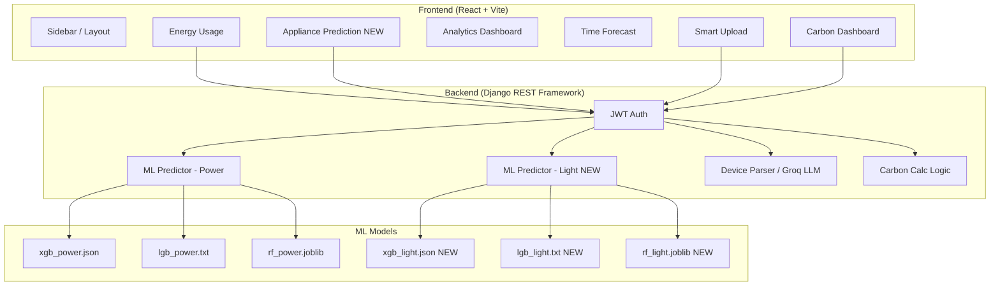

# Arka Energy Nexus: Project Blueprint & File Logic

This document provides a comprehensive breakdown of the **Home Energy Management System (HEMS)**, branded as **Arka Energy Nexus**.

> **Last Updated**: April 2, 2026 — v3 session: Appliance Prediction page, dual ML model deployment (power + light), API auth hardening, analytics date picker, sidebar cleanup, and full code audit patch round.

---

## 🏗️ 1. High-Level Architecture

---

## 2. Backend Logic (Django)

Located in `hems_backend/energy/`.

| File | Primary Logic |
|:---|:---|
| `models.py` | Database schema: `Building`, `Room`, `Device`, `Brand`, `UsageLog`, `CarbonTarget`, `ESGReport`, `PredictionLog` |
| `views/__init__.py` | Export hub. **[FIXED]** Now exports `predict_light_view` alongside `predict_power` and `predict_by_time`. |
| `views/predict.py` | ML endpoints: `PredictView` (POST /predict/), `PredictByTimeView` (GET /predict/time/), **[NEW]** `PredictLightView` (POST /predict/light/) |
| `views/smart_upload.py` | 2-step file ingestion: `preview/` parses, `save/` commits. Both require JWT auth. |
| `views/dashboard.py` | Carbon KPI aggregation from usage logs |
| `views/report.py` | Async PDF generation via `reportlab` with SSE status streaming |
| `views/calculator.py` | Real-time emission estimation by scope (Room/Floor/Building) |
| `views/target.py` | Monthly carbon target CRUD |
| `views/usage.py` | Usage log recording and emission calculation |
| `views/health.py` | `GET /api/health/` — no-auth health probe for deployment pipelines |
| `urls.py` | Request router. **[UPDATED]** includes `/api/energy/predict/light/` |
| `services/device_parser.py` | Wide-format Excel parser using `openpyxl`. Integrates Groq LLM (`mixtral-8x7b-32768`) via LangChain for unstructured rows. API key from `settings.GROQ_API_KEY`. |

### ML Models (`ml_models/`)

| File | Purpose |
|:---|:---|
| `predictor.py` | Loads all 6 models on startup. Exposes `predict()` (power) and **[NEW]** `predict_light()` (appliance). Both use 30% XGB + 40% LGB + 30% RF ensemble. |
| `xgb_power.json` | XGBoost Power — 500 estimators, max_depth=6 |
| `lgb_power.txt` | LightGBM Power — Best single model (R²=0.916) |
| `rf_power.joblib` | Random Forest Power — 300 estimators |
| `xgb_light.json` | **[NEW]** XGBoost Appliance/Lighting |
| `lgb_light.txt` | **[NEW]** LightGBM Appliance/Lighting |
| `rf_light.joblib` | **[NEW]** Random Forest Appliance/Lighting |

---

## 3. Frontend Logic (React)

Located in `hems_frontend/src/`.

### Pages (`/pages`)

| Page | Working & Logic |
|:---|:---|
| `HomePage.jsx` | Hero section with glowing globe + launch buttons |
| `EnergyUsage.jsx` | Live power monitor — 6 sensor inputs → `predict()` → 4 result cards + history chart. Clear History button. |
| `AppliancePrediction.jsx` | **[NEW]** Mirrors EnergyUsage layout. Uses `useAppliancePrediction` → `predictLight()` → 3 light ML models. Status thresholds tuned for appliance loads. |
| `AnalyticsDashboard.jsx` | KPI cards + trend chart with **manual date picker** (auto-`hourly` on select, resets to `daily` on clear). **[FIXED]** Date clear now resets granularity. |
| `TimeForecast.jsx` | User picks a datetime → `GET /predict/time/` → features computed server-side |
| `SmartUpload.jsx` | Wraps `IntelligentUpload`. **[FIXED]** JWT auth header injected into both preview and save calls. |
| `CarbonDashboard.jsx` | Monthly trend bar chart + device breakdown pie + building leaderboard |
| `CarbonTargetManager.jsx` | Monthly CO2 goal tracking |

### Components (`/components`)

| Component | Working & Logic |
|:---|:---|
| `Sidebar.jsx` | Navigation. **[UPDATED]** Added `Appliance Prediction` (Cpu icon). Removed: `Log Usage`, `ESG Reports`, `Settings`. |
| `IntelligentUpload.jsx` | Drag-and-drop upload → preview table → save. **[FIXED]** Uses `VITE_API_URL` env var (not hardcoded localhost). Auth token injected via `localStorage`. |
| `TopDragger.jsx` | Slide-down contact panel: `hitarthkhatiwala@gmail.com`, `+91 7096235959` |
| `charts/TrendLineChart.jsx` | Area chart. X-axis: `HH:mm` (hourly) / `MMM dd` (daily/weekly). **[FIXED]** Tooltip null guard (`?? 0`). |
| `charts/ForecastChart.jsx` | Dual-line 72h forecast chart |
| `charts/PeakHeatmap.jsx` | 7x24 weekly peak load heatmap |
| `charts/MiniPredictionChart.jsx` | Last-10-runs inline bar chart |
| `energy/PredictionForm.jsx` | 6-field sensor input form with live range validation |
| `energy/PredictionResultCards.jsx` | 4-card grid: Load, Status, Cost, Carbon |
| `analytics/InsightsPanel.jsx` | Derived observations from analytics data |
| `analytics/AnomalyAlerts.jsx` | Spike/voltage event alert feed |
| `analytics/RecommendationsEngine.jsx` | AI energy optimization tips |
| `analytics/CarbonIntelligence.jsx` | CO2 series chart + environmental breakdown |

### API Client (`/api/hemsApi.js`)

| Function | Purpose |
|:---|:---|
| `predict(params)` | Power prediction with mock fallback. **[FIXED]** Status compared as float. |
| `predictLight(params)` | **[NEW]** Calls `/api/energy/predict/light/` with JWT + correct `day_of_week` Python mapping + Sunday-aware `is_weekend`. |
| `getForecast(hours)` | 72h forecast with sinusoidal mock fallback |
| `getAnalytics(granularity, date)` | Date-aware analytics with AbortController timeout |

### Hooks (`/hooks`)

| Hook | Purpose |
|:---|:---|
| `useAnalytics.js` | **[FIXED]** Now uses `AbortController` with cleanup to prevent stale response races on fast granularity switching. |
| `useForecast.js` | Fetches 72h forecast. Exposes `refetch`. |
| `usePrediction.js` | Power prediction state + 10-run history + clearHistory |
| `useAppliancePrediction.js` | **[NEW]** Mirrors `usePrediction` but calls `predictLight()`. |

---

## 4. API Endpoint Reference

| Endpoint | Method | Auth | Purpose |
|:---|:---|:---|:---|
| `/api/energy/predict/` | POST | Required | Power prediction (14 features in body) |
| `/api/energy/predict/light/` | POST | Required | **[NEW]** Appliance/lighting prediction |
| `/api/energy/predict/time/` | GET | Open | Temporal forecast (features auto-computed) |
| `/api/energy/smart-upload/preview/` | POST | Required | Parse spreadsheet → JSON preview |
| `/api/energy/smart-upload/save/` | POST | Required | Commit devices to DB |
| `/api/energy/carbon/dashboard/` | GET | Required | Aggregated CO2 KPIs |
| `/api/energy/health/` | GET | Open | Deployment health probe |
| `/api/auth/login/` | POST | Open | JWT token exchange |
| `/api/auth/refresh/` | POST | Open | Token refresh |

---

## 5. ML Feature Set (14 features, shared by both model families)

| Category | Features |
|:---|:---|
| **Sensor** | `current`, `VLL`, `VLN`, `frequency`, `power_factor` |
| **Temporal** | `hour`, `day_of_week` (Python weekday, 0=Mon), `is_weekend`, `month` |
| **Lag** | `power_lag_1`, `power_lag_5`, `power_lag_10` |
| **Rolling** | `rolling_mean_5`, `rolling_std_5` |

- **Confidence**: Spread < 1 kW → HIGH | < 3 kW → MEDIUM | else LOW
- **Ensemble Weights**: XGBoost 30% + LightGBM 40% + Random Forest 30%

---

## 6. Technical Specifications

- **Emission Factor**: `0.82 kg CO2/kWh`
- **Tree Offset**: `~21 kg CO2/year` per tree
- **JWT Auth**: `localStorage` access token → `Authorization: Bearer` header
- **API Timeout**: 3000ms `AbortController` on all fetch calls
- **LLM Parser**: Groq `mixtral-8x7b-32768` via LangChain
- **Styling**: Tailwind CSS + Framer Motion
- **Theme**: Light Mode = Crystal Glass | Dark Mode = Deep Void

---

## 7. Code Audit Log (April 2, 2026)

| Severity | File | Bug | Status |
|:---|:---|:---|:---|
| 🔴 | `views/__init__.py` | `predict_light_view` not exported → ImportError | Fixed |
| 🔴 | `IntelligentUpload.jsx` | API_BASE_URL hardcoded to localhost | Fixed |
| 🔴 | `hemsApi.js` | `predict()` status compared string vs number | Fixed |
| 🔴 | `hemsApi.js` | `predictLight()` same string comparison bug | Fixed |
| 🟡 | `hemsApi.js` | `day_of_week` JS `getDay()` vs Python `weekday()` offset | Fixed |
| 🟡 | `hemsApi.js` | `is_weekend` missed Sunday (getDay=0) | Fixed |
| 🟡 | `TrendLineChart.jsx` | `.toFixed()` crash on null tooltip value | Fixed |
| 🟡 | `useAnalytics.js` | No cleanup → stale response race condition | Fixed |
| 🟡 | `AnalyticsDashboard.jsx` | Date clear stuck granularity on hourly | Fixed |
| 🟡 | `Sidebar.jsx` | Duplicate Zap icon for two nav items | Fixed |
| 🟢 | `AppliancePrediction.jsx` | Stale dev TODO text in JSX comments | Fixed |
| 🟢 | `device_parser.py` | API key hardcoded as source fallback | Move to .env before prod |
