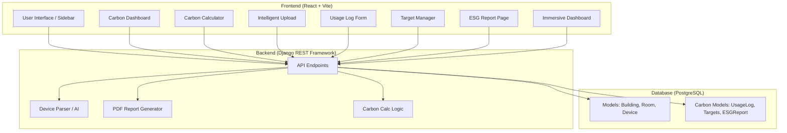

# Arka Energy Nexus: Project Blueprint & File Logic

This document provides a comprehensive breakdown of the **Home Energy Management System (HEMS)**, branded as **Arka Energy Nexus**. It covers project-wide features, architecture, and the logic behind every file in the codebase.

---

## 🏗️ 1. High-Level Architecture

The project follows a modern decoupled architecture with a Django backend and a React frontend.

---

## ⚡ 2. Backend Logic (Django)

Located in `hems_backend/energy/`.

| File | Primary Working & Logic |
|:---|:---|
| `models.py` | **Database Schema.** Defines core tables: `Building`, `Room`, `Device`, `Brand`, `DeviceCategory`. Includes the Carbon extension models: `UsageLog` (daily device hours), `CarbonTarget` (building goals), and `ESGReport` (PDF storage). **[NEW]** `DetailedDeviceRecord` for minute-level energy tracking with pre-calculated `energy_kwh` and `carbon_kg` fields. |
| `views/` | **Business Logic Package.** Split into modules for modularity: • `dashboard.py`: Carbon calculation logic. • `report.py`: PDF generation using `reportlab`. • `usage.py`: Usage logging endpoints. • `smart_upload.py`: File upload processing. • `calculator.py`: **[NEW]** Real-time emission estimation logic with scope support (Room/Floor/Building). • `target.py`: **[NEW]** Logic to set and retrieve monthly carbon targets. • `predict.py`: **[NEW]** ML-powered forecasting using XGBoost + LightGBM ensemble. Endpoints: `/predict/` (POST for batch prediction) and `/predict/time/` (GET for temporal forecasting). |
| `viewsets.py` | **RESTful API Core.** Uses Django REST Framework (DRF) to provide full CRUD capabilities for Devices, Buildings, and Rooms. |
| `urls.py` | **The Router.** Maps incoming web requests to specific Python functions/classes. Defines the structure of the `/api/` endpoints. |
| `services/device_parser.py` | **Smart Data Ingestion.** The most complex file in the backend. It uses `openpyxl` and `pandas` to "unpivot" wide-format energy audit spreadsheets. It can handle merged cells and multi-column device layouts. |
| `services/normalization.py` | **Normalization Service.** Helper classes that clean raw data (e.g., fixing brand typos from "Hiatchi" to "Hitachi") before it reaches the database. Previously `services.py`. |
| `serializers.py` | **Data Transformation.** Converts complex Django model objects into simple JSON format that the React frontend can understand. |
| `admin.py` | **Backend Management.** Configurations for the Django Admin interface (`/admin`), allowing manual database edits. |

### 🔧 Management Commands (`management/commands/`)
| Command | Purpose |
|:---|:---|
| `import_smart_devices.py` | **[NEW] Automated Device Import.** CLI tool to parse Excel/CSV files and bulk-import devices into the database. Uses `DeviceSpreadsheetParser` for intelligent header detection. Supports `--no-llm` flag to disable LLM-based parsing and fall back to regex patterns. |

### 🤖 Machine Learning Models (`ml_models/`)
| File | Purpose |
|:---|:---|
| `predictor.py` | **Service Layer.** Loads pre-trained XGBoost, LightGBM, and Random Forest models on Django startup. Exposes `predict(feature_dict) → dict` function returning weighted ensemble predictions (30% XGB + 40% LGB + 30% RF). Maintains `FEATURES` list for the 14-feature input. |
| `xgb_power.json` | **XGBoost Model.** Trained regressor in JSON format. 500 estimators, max_depth=6, learning_rate=0.05. |
| `lgb_power.txt` | **LightGBM Model.** Booster saved in text format. Best single-model performance (R²=0.916). |
| `rf_power.joblib` | **Random Forest Model.** Scikit-learn regressor saved via joblib. 300 estimators, max_depth=20. |

---

## 🎨 3. Frontend Logic (React)

Located in `hems_frontend/src/`.

### 📄 Pages (`/pages`)
| Page | Working & Logic |
|:---|:---|
| `CarbonDashboard.jsx` | **Emissions Hub.** Fetches data from `/api/carbon/dashboard/`. Uses `recharts` to render the "Monthly Trend" bar chart and "Device Breakdown" pie chart. Implements a Building Leaderboard. |
| `CarbonCalculator.jsx` | **[NEW] Emission Estimator.** A powerful tool often found in high-end ESG platforms. Allows users to simulate carbon impact by scope (Room, Floor, Building) and time duration (1 hour to 1 year). |
| `ImmersiveDashboard.jsx` | **[NEW] Visual Landing.** A high-tech, glassmorphic landing page featuring 3D-like floating cards and a cinematic entry. Serves as the visual "Wow" factor. |
| `UsageLogForm.jsx` | **Data Entry.** A dynamic form that loads Buildings, then Rooms, then Devices in a cascading sequence. Automatically previews the carbon impact before the user submits. |
| `CarbonTargetManager.jsx` | **Environmental Goals.** Interface to set monthly CO2 limits. Logic calculates "Status" based on actual vs. target emissions. |
| `ESGReportPage.jsx` | **Compliance.** Allows users to request a new PDF report. Logic handles polling and sequential download of generated PDF files. |
| `SmartUpload.jsx` | **Bulk Ingestion Hub.** Wraps the `IntelligentUpload` component to provide a seamless file import experience. |
| `HomePage.jsx` | **Hero Section.** Implements the immersive "Glowing Globe" and the launch buttons for the dashboard. |
| `TimeForecast.jsx` | **[NEW] ML-Powered Forecasting.** Predicts power consumption for a specific date and time using a blended ensemble of XGBoost (30%), LightGBM (40%), and Random Forest (30%) models. Uses 14 features: sensor readings (current, VLL, VLN, frequency, power_factor), temporal (hour, day_of_week, is_weekend, month), and lag/rolling stats (power_lag_1/5/10, rolling_mean_5, rolling_std_5). |

### 🧩 Components (`/components`)
| Component | Working & Logic |
|:---|:---|
| `IntelligentUpload.jsx` | **[NEW] AI-Powered Parsing.** Replaces the old drag-and-drop. It uploads the file to `smart_upload/preview/`, receives a JSON preview of parsed devices, allows user edits in a table, and then commits to the DB. |
| `Sidebar.jsx` | **Global Navigation.** Manages the navigation links. Contains the newly enlarged **ARKA** branding and logo logic. |
| `CarbonTransition.jsx` | **Cinematic Entry.** A full-screen overlay with motion effects that plays when the user enters the Carbon Intelligence section. |
| `GlowingGlobe.jsx` | **Visual Background.** Uses CSS gradients and Framer Motion to create a pulsating, high-tech globe effect behind the UI. |
| `GlassContainer.jsx` | **UI Styling Shell.** The foundation of the project's **Glassmorphism** design. Applies blur and transparency consistently. |
| `RotatingTreeLoader.jsx` | **[NEW] Loading Animation.** A rotating tree icon with glowing effects. Used during data processing transitions to provide visual feedback during forecasting and uploads. |
| `TopDragger.jsx` | **[NEW] Draggable Contact Panel.** An animated modal that slides down from the top of the page. Features contact information, support details, and an interactive communication hub for user engagement. |

### 📡 API Services (`/api`)
| Service | Purpose |
|:---|:---|
| `predictPower.js` | **[NEW] ML Forecast Client.** Exports `predictPower(isoString) → Promise<object>` function that GETs `/api/predict/time/?datetime=`. All 14 features are computed server-side. Returns predictions and individual model scores. |

---

## 🤖 4. Machine Learning Pipeline & Forecasting

### Overview
The HEMS uses the **V-2-ROBUST** ensemble pipeline for energy forecasting. Three models (XGBoost, LightGBM, Random Forest) are trained on ~13,700 IoT sensor readings from ThingSpeak (feeds_5.csv, 27 Feb – 30 Mar 2026) and blended to predict next-step power consumption.

### ML Architecture
- **Model Persistence**: Models are stored in `hems_backend/ml_models/`:
  - `xgb_power.json`: XGBoost regressor (R²=0.898)
  - `lgb_power.txt`: LightGBM booster (R²=0.916, best single model)
  - `rf_power.joblib`: Random Forest regressor (R²=0.902)
  - `predictor.py`: Ensemble service (30% XGB + 40% LGB + 30% RF)

### Data Pipeline
1. **Raw IoT data** (18,283 rows, ~60s interval)
2. **EDA & Cleaning**: Drop unusable columns, remove nulls, filter zero-power, fix power_factor outliers → ~13,767 clean rows
3. **Feature Engineering**: Time features + lag features + rolling stats → 14 features
4. **Chronological 80/20 split** (no shuffle) with TimeSeriesSplit CV (5 folds)

### Feature Set (14 features)

| Category | Features |
|:---|:---|
| **Sensor** | `current`, `VLL`, `VLN`, `frequency`, `power_factor` |
| **Temporal** | `hour`, `day_of_week`, `is_weekend`, `month` |
| **Lag** | `power_lag_1`, `power_lag_5`, `power_lag_10` |
| **Rolling** | `rolling_mean_5`, `rolling_std_5` |

- **Target**: `power` (next row) — time-shifted for next-step forecasting
- **No kVA leakage**: kVA is excluded to prevent target leakage

### Forecast Workflow
1. **Input**: Datetime string (ISO 8601 format)
2. **Feature Generation**: `views/predict.py` constructs 14-feature vector from temporal attributes and hourly sensor averages
3. **Ensemble Prediction**: XGBoost, LightGBM, Random Forest predict independently, results blended with weights (30/40/30)
4. **Confidence**: Based on model agreement (spread < 1kW = HIGH, < 3kW = MEDIUM, else LOW)
5. **Output**: `predicted_power_kw`, `predicted_co2_kg`, individual model predictions, confidence, day type, load level

### API Endpoints

| Endpoint | Method | Purpose |
|:---|:---|:---|
| `/api/predict/` | POST | Internal-only: accepts all 14 features in request body (auth required) |
| `/api/predict/time/` | GET | Public forecasting: `?datetime=2026-03-22T15:00:00` (features computed server-side) |

---

## 📈 5. Core Feature Workflows

### 🌍 Carbon Intelligence Flow
1. **Logging**: User logs device hours via `UsageLogForm`.
2. **Calculation**: Backend calculates $CO_2 = (\text{Watts} \times \text{Hours} / 1000) \times 0.82$.
3. **Visualization**: `CarbonDashboard` fetches aggregated data to show KPIs (Total CO2, Trees Offset).
4. **Reporting**: `views/report.py` uses `reportlab` to build a 5-page PDF document based on this data.

### 🧮 Emission Estimation Flow (New)
1. **Selection**: User selects a Scope (Room/Floor/Building) and Duration (e.g., 1 Year).
2. **Simulation**: Backend sums up wattage for all devices in that scope.
3. **Projection**: Calculates projected $CO_2$ and "Trees Required to Offset".
4. **Comparison**: Frontend displays bar charts comparing emissions across different Rooms or Floors.

### ⚡ Smart Bulk Upload Flow (Updated)
1. **Upload**: User drops an Excel sheet into `IntelligentUpload`.
2. **AI Parsing**: `services/device_parser.py` intelligently detects headers, device types, and merged cells.
3. **Preview & Edit**: User sees a structured table of *proposed* devices. They can correct wattages or names *before* saving.
4. **Ingestion**: `views/smart_upload.py` saves the validated list, automatically creating hierarchy (Buildings > Rooms) as needed.

### ⚡ Time Forecast Flow (New)
1. **Input**: User selects a date/time via `TimeForecast.jsx`
2. **Temporal Feature Engineering**: Backend computes hour, day-of-week, cyclical embeddings, business hours flag
3. **Ensemble Inference**: XGBoost and LightGBM models score independently
4. **Blending & Output**: Weighted predictions (40% XGB, 60% LGB) compute final kW and CO2 estimates
5. **Confidence Scoring**: If model disagreement < 1 kW → *High*, < 3 kW → *Medium*, else *Low*
6. **Visualization**: Frontend shows predicted power, CO2, day type (Weekday/Weekend), and load level (Low/Medium/High/Peak)

---

## 🛠️ 6. Technical Specifications
- **Emission Factor**: Fixed at `0.82` kg CO2/kWh.
- **Tree Offset Logic**: Calculated at approx. `21` kg CO2 per year per tree (standard ESG metric).
- **Styling**: Tailwind CSS + Framer Motion.
- **Theme**: Light Mode uses "Crystal Glass" styling; Dark Mode uses "Deep Void" styling.
