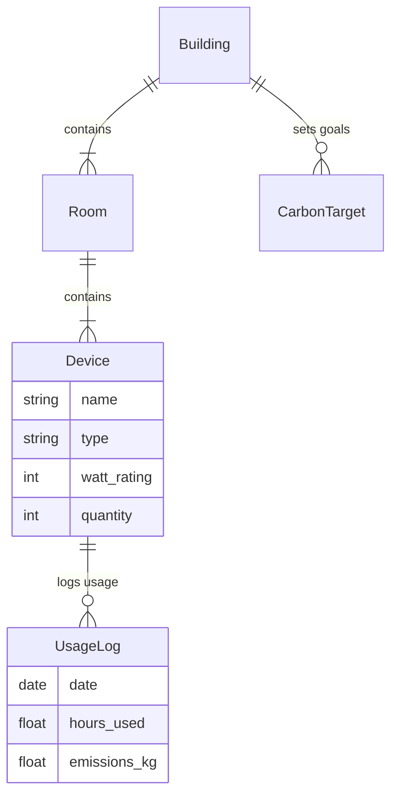

# HEMS Backend Blueprint & Logic

This document provides a detailed technical breakdown of the **hems_backend** (Django REST Framework). It covers the data models, API structure, and core business logic for energy management and carbon reporting.

---

## 🏗️ Architecture Overview

The backend is built with **Django 5.x** and **Django REST Framework (DRF)**. It serves as the data persistence and logic layer for the React frontend.

**Key Responsibilities:**
- **Data Management**: CRUD operations for Buildings, Rooms, and Devices.
- **Carbon Intelligence**: Calculating CO2 emissions based on device usage logs.
- **Smart Ingestion**: Parsing complex Excel/CSV files to bulk-import device inventories.
- **Reporting**: Generating PDF compliance reports using `reportlab`.

---

## 📂 File Logic & Responsibilities

All core logic resides in `hems_backend/energy/`.

| File | Type | Responsibility & Logic |
|:---|:---|:---|
| `models.py` | **Schema** | Defines the database structure. Key models: • `Building`, `Room`, `Device`: Core hierarchy. • `UsageLog`: Records daily hours for carbon calc. • `CarbonTarget`: Stores monthly emission goals. • `ESGReport`: Stores generated PDF paths. |
| `urls.py` | **Routing** | Maps HTTP requests to ViewSets or Function Views. • `/api/devices/`: Router-based CRUD. • `/api/carbon/dashboard/`: Custom dashboard stats. • `/api/smart-upload/`: Special 2-step upload endpoints. |
| `viewsets.py` | **API (CRUD)** | Standard DRF ViewSets for `Device`, `Building`, `Room`. • `DeviceViewSet`: Handles standard JSON API requests. • `upload_detailed_excel`: Legacy endpoint for specific formatted uploads. |
| `views/dashboard.py` | **Business Logic** | Carbon Dashboard logic. • `carbon_dashboard`: Aggregates usage logs to compute Total CO2, Top Rooms, & Device Breakdown. |
| `views/report.py` | **Reporting** | PDF Generation. • `esg_report`: Uses `reportlab` to generate professional multi-page PDF reports. |
| `views/usage.py` | **Business Logic** | Usage Logging. • `log_usage`: Records device usage hours and calculates emissions. |
| `views/smart_upload.py` | **API (Upload)** | Smart Upload Logic. • `preview`: Parses file and returns JSON preview. • `save`: Commits verified data to DB. |
| `services/device_parser.py` | **Data Processing** | The core "Smart Upload" engine. • Uses `openpyxl`/`pandas` to extract data. • Detects "Wide" formats and unpivots them. |
| `services/normalization.py` | **Utilities** | Data Cleaning Services. • `normalize_brand()`: Fuzzy matching for brand names. • Previously `services.py`. |
| `serializers.py` | **Serialization** | Converts Django Models <-> JSON. • `DeviceSerializer`: Includes nested `building_name` and `room_name`. |

---

## 📊 Database Schema (Models)

- **Carbon Factor**: Hardcoded as `0.82 kg/kWh` in aggregation logic.
- **Tree Offset**: `~21 kg/year` per tree.

---

## 🔄 Core Workflows

### 1. Smart Bulk Upload
This feature allows users to drag-and-drop raw Excel files.
1. **Upload**: File sent to `views/smart_upload.py` -> `preview_smart_upload`.
2. **Parsing**: `services/device_parser.SmartDeviceParser` handles the file.
   - Detects headers dynamically.
   - Iterates rows, extracting Device Type, Quantity, Wattage.
   - **Unpivoting**: If a row has "2 ACs, 5 Fans", it splits into multiple device records.
3. **Response**: JSON array of *proposed* devices sent back to Frontend.
4. **Confirmation**: User clicks "Save" -> `save_smart_upload`.
5. **Commit**: Backend uses `transaction.atomic()` to create Buildings/Rooms on the fly and insert Devices.

### 2. Carbon Calculation
1. **Input**: User logs "5 hours" for an AC via `UsageLogForm`.
2. **Process**:
   - `kWh = (Device.watts * 5h) / 1000`
   - `CO2 = kWh * 0.82`
   - Record saved in `UsageLog` table.
3. **Dashboarding**: `views/dashboard.py` queries `UsageLog`.
   - Sums all CO2 for the current month.
   - Compares vs `CarbonTarget`.

### 3. PDF Report Generation
1. **Trigger**: User requests report in UI.
2. **Generation**: `views/report.py` initializes a `reportlab.canvas`.
   - Draws Cover Page (Logo, Title, Date).
   - Draws "Executive Summary" (Total Emissions, Top Consumers).
   - Iterates through Buildings to add detailed breakdown tables.
3. **Output**: File saved to `media/reports/` and URL returned to Frontend.
