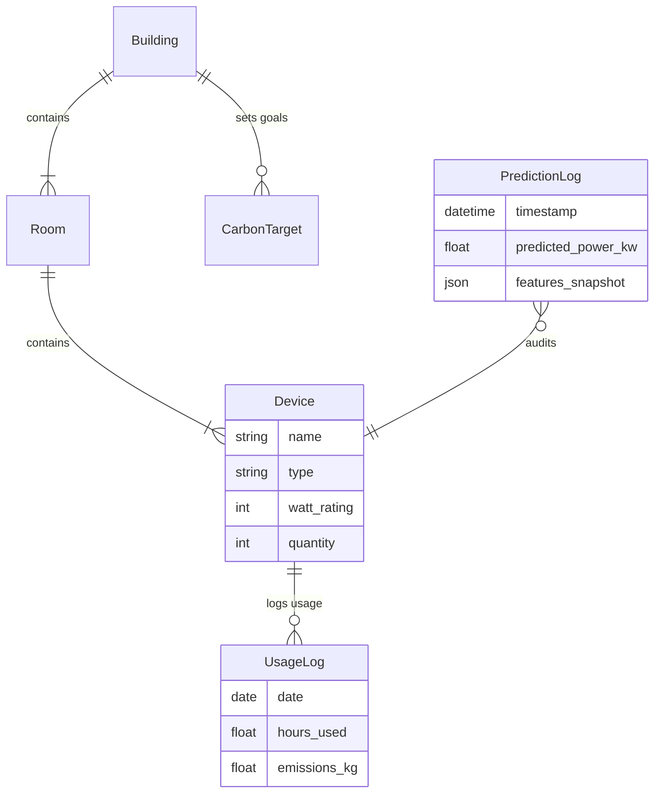

# HEMS Backend Blueprint & Logic

This document provides a detailed technical breakdown of the **hems_backend** (Django REST Framework). It covers the data models, API structure, and core business logic for energy management and carbon reporting.

---

## 🏗️ Architecture Overview

The backend is built with **Django 5.x** and **Django REST Framework (DRF)**. It serves as the data persistence and logic layer for the React frontend.

**Key Responsibilities:**
- **Data Management**: CRUD operations for Buildings, Rooms, and Devices.
- **Carbon Intelligence**: Calculating CO2 emissions based on device usage logs.
- **Smart Ingestion**: Parsing complex Excel/CSV files to bulk-import device inventories.
- **ML Forecasting**: Two independent ensemble prediction engines (power + appliance/lighting).
- **Reporting**: Generating PDF compliance reports using `reportlab`.

---

## 📂 File Logic & Responsibilities

All core logic resides in `hems_backend/energy/`.

| File | Type | Responsibility & Logic |
|:---|:---|:---|
| `models.py` | **Schema** | Defines the database structure. Key models: • `Building`, `Room`, `Device`: Core hierarchy. • `UsageLog`: Records daily hours for carbon calc. • `CarbonTarget`: Stores monthly emission goals. • `ESGReport`: Stores generated PDF paths. • `PredictionLog`: Audit trail for ML prediction requests. |
| `views/__init__.py` | **Export Hub** | Exports all view callables. **[FIXED]** Now exports `predict_light_view` alongside `predict_power` and `predict_by_time`. Missing export caused ImportError on server restart. |
| `urls.py` | **Routing** | Maps HTTP requests to ViewSets or Function Views. • `/api/devices/`: Router-based CRUD. • `/api/carbon/dashboard/`: Custom dashboard stats. • `/api/smart-upload/`: 2-step upload endpoints (auth required). • **[NEW]** `/api/energy/predict/light/`: Appliance/lighting ML endpoint. |
| `viewsets.py` | **API (CRUD)** | Standard DRF ViewSets for `Device`, `Building`, `Room`. |
| `views/dashboard.py` | **Business Logic** | Carbon Dashboard logic. • `carbon_dashboard`: Aggregates usage logs to compute Total CO2, Top Rooms, & Device Breakdown. |
| `views/predict.py` | **ML Endpoints** | Three prediction endpoints: • `PredictView` (POST /predict/): Full power prediction, auth-required. • `PredictByTimeView` (GET /predict/time/): Temporal forecast with auto feature generation. • **[NEW]** `PredictLightView` (POST /predict/light/): Appliance-specific prediction using the light model trio. |
| `views/report.py` | **Reporting** | PDF Generation with SSE status streaming. |
| `views/usage.py` | **Business Logic** | Usage Logging. Records device hours and calculates emissions. |
| `views/smart_upload.py` | **API (Upload)** | Smart Upload Logic. `preview`: Parses file → JSON. `save`: Commits to DB. Both require JWT auth. |
| `views/health.py` | **Health Probe** | `GET /api/health/` — no-auth endpoint for load-balancers. |
| `services/device_parser.py` | **Data Processing** | Wide-format Excel parser using `openpyxl`/`pandas`. Integrates Groq LLM (`mixtral-8x7b-32768`) via LangChain for unstructured rows. API key sourced from `settings.GROQ_API_KEY`. |
| `services/normalization.py` | **Utilities** | Data Cleaning. `normalize_brand()`: Fuzzy matching for brand names. |
| `serializers.py` | **Serialization** | Converts Django Models <-> JSON. `DeviceSerializer` includes nested `building_name` and `room_name`. |

---

## 📊 Database Schema (Models)

- **Carbon Factor**: Hardcoded as `0.82 kg/kWh` in aggregation logic.
- **Tree Offset**: `~21 kg/year` per tree.

---

## 🔄 Core Workflows

### 1. Smart Bulk Upload
This feature allows users to drag-and-drop raw Excel files.
1. **Upload**: File sent to `views/smart_upload.py` -> `preview_smart_upload`.
2. **Parsing**: `services/device_parser.SmartDeviceParser` handles the file.
   - Detects headers dynamically.
   - Iterates rows, extracting Device Type, Quantity, Wattage.
   - **Unpivoting**: If a row has "2 ACs, 5 Fans", it splits into multiple device records.
3. **Response**: JSON array of *proposed* devices sent back to Frontend.
4. **Confirmation**: User clicks "Save" -> `save_smart_upload`.
5. **Commit**: Backend uses `transaction.atomic()` to create Buildings/Rooms on the fly and insert Devices.

### 2. Carbon Calculation
1. **Input**: User logs "5 hours" for an AC via `UsageLogForm`.
2. **Process**:
   - `kWh = (Device.watts * 5h) / 1000`
   - `CO2 = kWh * 0.82`
   - Record saved in `UsageLog` table.
3. **Dashboarding**: `views/dashboard.py` queries `UsageLog`.
   - Sums all CO2 for the current month.
   - Compares vs `CarbonTarget`.

### 4. Appliance Prediction Flow (New)
1. **Input**: User fills 6 sensor parameters on `AppliancePrediction.jsx`
2. **API Call**: `POST /api/energy/predict/light/` with JWT and 14-feature payload
3. **Feature Construction**: Frontend maps JS `getDay()` → Python `weekday()` and correctly identifies Sunday as weekend
4. **Ensemble Inference**: `predict_light()` runs `xgb_light`, `lgb_light`, `rf_light` in parallel
5. **Blending**: 30/40/30 weighted ensemble → final kW
6. **Output**: `predicted_power_kw`, `confidence`, `model_spread`, CO2 estimate

---

## 🐛 5. Bug Fix Registry

| File | Bug | Fix |
|:---|:---|:---|
| `views/__init__.py` | `predict_light_view` not exported | Added to exports |
| `views/predict.py` | `PredictLightView` had no corresponding URL | Added `/predict/light/` route |
| `ml_models/predictor.py` | Light models not loaded on startup | Added `_xgb_light`, `_lgb_light`, `_rf_light` load block |
